# Projeto de Previsão de Vendas - Rossmann

# Introdução
Este é um projeto end-to-end de Data Science com modelo de regressão adaptada para séries temporais. Foram criados 4 tipos de modelos para predizer o valor das vendas das lojas Rossmann nas próximas 6 semanas. As previsões podem ser acessadas pelo usuário por meio de um BOT no aplicativo do Telegram.

Este repositório contém a solução para a resolução de um problema do Kaggle: https://www.kaggle.com/c/rossmann-store-sales

### Plano de desenvolvimento do projeto

Este projeto foi desenvolvido seguindo a metodologia do CRISP-DM (Cross-Industry Standard Process for Data Mining), mas com um enfoque maior para Ciência de Dados. Dessa forma, o processo tradicional do CRISP-DM foi expandido para contemplar melhor o desenvolvimento e a implementação de modelos de Machine Learning, garantindo um fluxo mais robusto e alinhado às demandas atuais da área.

1. **Questão de Negócio** – O primeiro passo é definir claramente o problema que se deseja resolver. Aqui, compreendi os desafios e objetivos que o projeto precisa atender.
2. **Entendimento do Negócio** – Nesta etapa, analisei o contexto do problema, explorei as necessidades do usuário e identifiquei quais insights e previsões são mais valiosas.
3. **Coleta de Dados** – Busquei, extraí e armazenei os dados necessários para a análise, garantindo que sejam relevantes e confiáveis.
4. **Limpeza dos Dados** – Apliquei técnicas de data wrangling, removendo inconsistências, lidando com valores ausentes e padronizando o formato dos dados para garantir qualidade.
5. **Exploração dos Dados** – Realizei uma Análise Exploratória dos Dados (EDA), identificando padrões, tendências e possíveis problemas nos dados.
6. **Modelagem dos Dados** – Selecionei as variáveis mais relevantes e transformei os dados para alimentar os modelos de Machine Learning.
7. **Algoritmos de Machine Learning** – Apliquei diferentes modelos e técnicas, ajustando hiperparâmetros e otimizando a performance.
8. **Avaliação do Algoritmo** – Medi a performance dos modelos com métricas apropriadas, garantindo que atendam aos requisitos do projeto.
9. **Modelo em Produção** – Implementei a solução em um ambiente real, disponibilizando o modelo para uso e monitorando seu desempenho.

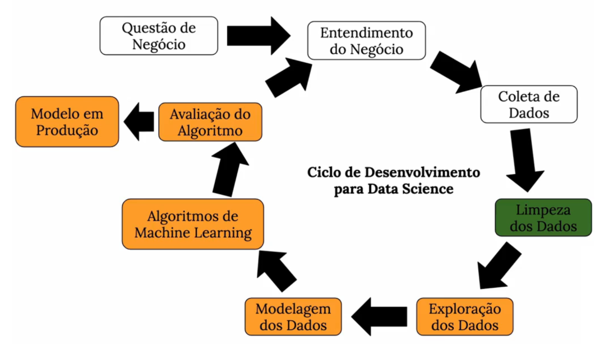

### Sumário

* [1. Descrição e Problema de Negócio](#1-descrição-e-problema-de-negócio)
* [2. Base de Dados](#2-base-de-dados)
* [3. Estratégia de Solução](#3-estratégia-de-solução)
* [4. Featuring Engineering](#4-featuring-engineering)
* [5. Análise Exploratória dos Dados](#5-análise-exploratória-dos-dados)
* [6. Seleção do Modelo de Machine Learning](#6-seleção-do-modelo-de-machine-learning)
* [7. Performance do Modelo](#7-performance-do-modelo)
* [8. Resultados de Negócio](#8-resultados-de-negócio)
* [9. Modelo em Produção](#9-modelo-em-produção)
* [10. Conclusão](#10-conclusão)
* [11. Aprendizados e Trabalhos Futuros](#11-aprendizados-e-trabalhos-futuros)

# 1. Descrição e Problema de Negócio

## 1.1. Descrição

A Rossmann, uma das maiores redes de drogarias da Europa, opera mais de 3.000 lojas em 7 países. Atualmente, os gerentes das lojas são responsáveis por prever as vendas diárias com até seis semanas de antecedência. No entanto, essa tarefa pode ser desafiadora, pois as vendas são impactadas por diversos fatores, como:

* Promoções e descontos;
* Concorrência na região;
* Feriados escolares e estaduais;
* Sazonalidade e tendências de mercado;
* Características específicas da localidade.

Com mais de mil gerentes tomando decisões individualmente com base em suas próprias experiências, a precisão das previsões pode variar significativamente.

## 1.2. Problema de Negócio

A Rossmann deseja um modelo de previsão de vendas confiável, capaz de gerar previsões diárias para 1.115 lojas na Alemanha. Previsões precisas permitirão:

1. Melhor planejamento da equipe, aumentando a produtividade e a satisfação dos funcionários;
2. Redução de custos operacionais, evitando excesso ou falta de funcionários;
3. Aprimoramento da experiência do cliente, garantindo que a equipe esteja sempre preparada para a demanda esperada.

O desafio consiste em desenvolver um modelo robusto de Machine Learning para prever as vendas diárias das lojas ao longo de seis semanas. Além disso, será necessário fornecer ao CEO uma forma de consulta rápida dessas previsões por meio do celular, garantindo acesso fácil e ágil às informações estratégicas.

# 2. Base de dados

O conjunto de dados possui as seguintes variáveis:

| Variável                          | Descrição |
|-----------------------------------|-----------|
| **Id**                            | Um identificador que representa um par (Loja, Data) dentro do conjunto de teste. |
| **Store**                         | Um identificador único para cada loja. |
| **Sales**                         | O faturamento de um determinado dia (essa é a variável que será prevista). |
| **Customers**                     | O número de clientes em um determinado dia. |
| **Open**                          | Indicador de funcionamento da loja: 0 = fechada, 1 = aberta. |
| **StateHoliday**                  | Indica um feriado estadual. Normalmente, todas as lojas, com algumas exceções, estão fechadas nesses dias. Todas as escolas estão fechadas em feriados públicos e finais de semana.   **a** = feriado público, **b** = feriado de Páscoa, **c** = Natal, **0** = nenhum feriado. |
| **SchoolHoliday**                 | Indica se a loja foi afetada pelo fechamento das escolas públicas naquela data. |
| **StoreType**                     | Diferencia quatro tipos diferentes de lojas: **a, b, c, d**. |
| **Assortment**                    | Descreve o nível de variedade de produtos da loja:   **a** = básico, **b** = extra, **c** = estendido. |
| **CompetitionDistance**           | Distância, em metros, até a loja concorrente mais próxima. |
| **CompetitionOpenSince[Month/Year]** | Indica o mês e o ano aproximado em que a loja concorrente mais próxima foi inaugurada. |
| **Promo**                         | Indica se a loja está realizando uma promoção naquele dia. |
| **Promo2**                        | Promoção contínua e consecutiva para algumas lojas: **0** = a loja não participa, **1** = a loja participa. |
| **Promo2Since[Year/Week]**        | Indica o ano e a semana do calendário em que a loja começou a participar da Promo2. |
| **PromoInterval**                 | Descreve os intervalos consecutivos em que a Promo2 é iniciada, indicando os meses em que a promoção se renova.   Exemplo: **"Fev, Mai, Ago, Nov"** significa que a promoção se inicia novamente em fevereiro, maio, agosto e novembro de cada ano para aquela loja. |

# 3. Estratégia de Solução

A estratégia adotada foi dividida nas seguintes etapas:

### Etapa 01: Análise do Conjunto de Dados
Inicialmente, foi realizada uma análise do conjunto de dados, verificando aspectos como os nomes das colunas, as dimensões do conjunto, os tipos de dados, além da identificação e preenchimento de valores ausentes (NA). Também foi realizada uma análise descritiva das variáveis, identificando quais eram categóricas.
### Etapa 02: Featuring Engineering
Nesta etapa, foram criados novos atributos (colunas) a partir das variáveis originais, com o objetivo de melhorar a compreensão dos fenômenos representados por cada variável.
### Etapa 03: Filtragem de Dados
O conjunto de dados foi filtrado de duas formas: primeiro, removendo as linhas que não correspondiam às lojas ativas e que não realizaram vendas (open != 0 e sales > 0), e segundo, eliminando colunas que não agregavam valor à análise ou cujos dados já haviam sido derivados para outras variáveis.
### Etapa 04: Análise Exploratória dos Dados (EDA)
Foi realizada uma exploração detalhada dos dados com o intuito de identificar insights valiosos para o entendimento do negócio. Foram realizadas análises univariadas, bivariadas e multivariadas, buscando descobrir padrões e correlações importantes entre as variáveis.
### Etapa 05: Preparação dos Dados
Nesta fase, os dados foram preparados para serem utilizados nos algoritmos de Machine Learning. Isso envolveu a aplicação de técnicas de normalização e codificação, convertendo variáveis categóricas em valores numéricos.
### Etapa 06: Seleção de Atributos para o Modelo
A seleção das variáveis mais relevantes foi realizada utilizando o método Boruta, que ajudou a identificar os atributos com maior impacto na performance do modelo.
### Etapa 07: Treinamento do Modelo de Machine Learning
Os modelos de Machine Learning foram treinados utilizando o conjunto de dados, e aquele que obteve a melhor performance, considerando a validação cruzada, seguiu para a próxima fase, que consistiu na otimização dos parâmetros do modelo para melhorar sua generalização.
### Etapa 08: Ajuste de Hiperparâmetro
Nesta etapa, os parâmetros do modelo foram ajustados para maximizar o aprendizado, utilizando o método RandomSearch para encontrar a combinação ideal de valores.
### Etapa 09: Conversão dos Resultados em Valor de Negócio
O desempenho do modelo foi analisado do ponto de vista do impacto no negócio, traduzindo os resultados para métricas que pudessem agregar valor real à empresa.
### Etapa 10: Implantação do Modelo em Produção
O modelo foi colocado em produção em um ambiente de nuvem (Render), permitindo que ele fosse acessado por diferentes usuários ou serviços, facilitando o processo de tomada de decisão no negócio.
### Etapa 11: Criação de um Bot no Telegram
Foi desenvolvido um bot no Telegram, permitindo que as previsões pudessem ser acessadas a qualquer hora e de qualquer lugar, bastando para isso uma conexão à internet e o aplicativo instalado no celular.

# 4. Featuring Engineering

Nesta etapa, novas variáveis foram criadas para capturar padrões temporais e melhorar a qualidade dos dados utilizados no modelo. Essas variáveis ajudam a destacar tendências sazonais e o impacto de diferentes períodos no volume de vendas.

Foram extraídas informações como:
* Dia, mês e ano das vendas para identificar variações sazonais.
* Semana do ano para capturar eventos recorrentes e feriados.
* Transformações temporais, como a criação de variáveis cíclicas (seno e cosseno) para representar padrões semanais e mensais de forma contínua.

### 4.1. Mapeamento de Hipóteses

Antes da modelagem, foi feita uma análise detalhada dos fatores que influenciam as vendas. Para isso, um mapa mental foi estruturado, organizando hipóteses que relacionam variáveis como promoções, sazonalidade, concorrência e comportamento dos consumidores.

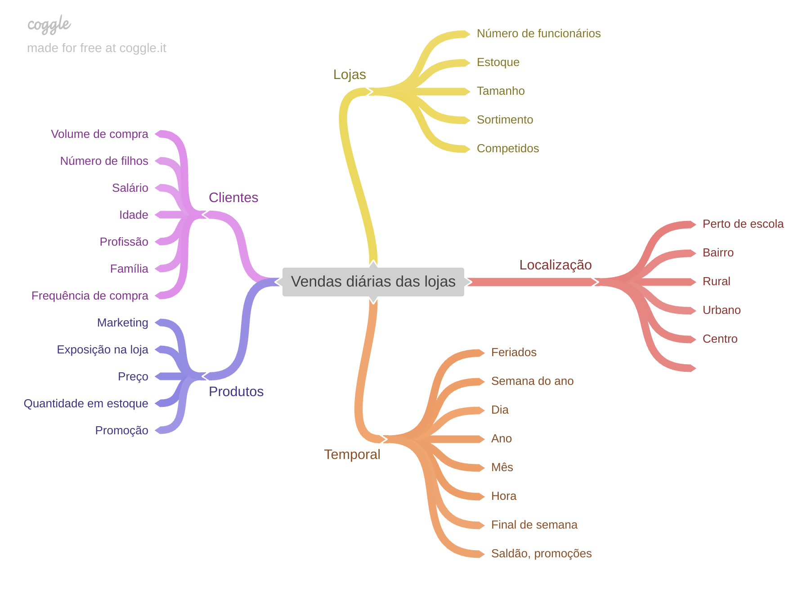

# 5. Análise Exploratória dos Dados

### 5.1. Análise Univariada

Para compreender melhor o comportamento das variáveis do conjunto de dados, foi realizada uma Análise Univariada, que permite observar a distribuição individual de cada variável e identificar padrões, outliers e tendências relevantes.

A análise das variáveis numéricas foi feita por meio de histogramas, que mostram a distribuição dos valores no dataset. Esses gráficos ajudam a identificar:

* Padrões de distribuição, como dados concentrados em certos intervalos.
* Presença de outliers, que podem impactar a modelagem.
* Assimetria dos dados, indicando possíveis transformações necessárias.

A visualização dessas distribuições auxilia na preparação dos dados e na definição de estratégias para tratamento de valores extremos e normalização das variáveis.

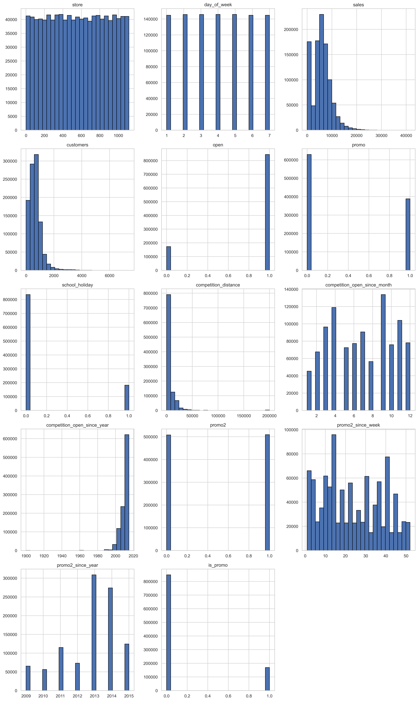

### 5.2. Análise Bivariada

Após a formulação das hipóteses no mapa mental, foi realizada a análise bivariada, que examina a relação entre a variável resposta (vendas) e as variáveis explicativas, como promoções, sazonalidade e concorrência.

Essa análise permitiu validar ou refutar as hipóteses iniciais, fornecendo insights valiosos sobre o comportamento das vendas. Alguns dos principais achados foram:

#### H2. Lojas com competidores mais próximos deveriam vender menos.

**FALSA Lojas com COMPETIDORES MAIS PROXIMOS vendem MAIS.**

Isso pode ser explicado pelo fato de que essas lojas estão localizadas em áreas de maior fluxo de clientes, onde a presença de múltiplas opções pode atrair mais consumidores e aumentar o volume de compras.

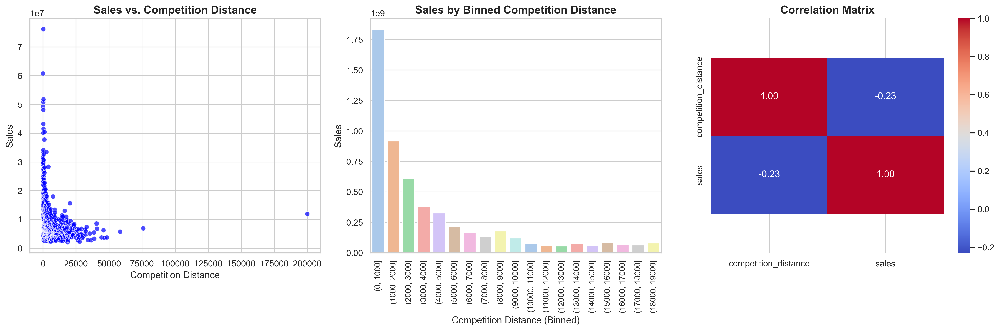

#### H3. Lojas com competidores à mais tempo deveriam vendem mais.

**FALSA Lojas com COMPETIDORES À MAIS TEMPO vendem MENOS.**

Isso pode ocorrer porque, ao longo do tempo, os clientes podem migrar para os concorrentes, especialmente se eles oferecerem preços mais competitivos, variedade de produtos ou melhores experiências de compra. Além disso, mudanças no mercado e novas estratégias da concorrência podem impactar negativamente o desempenho das lojas da Rossmann.

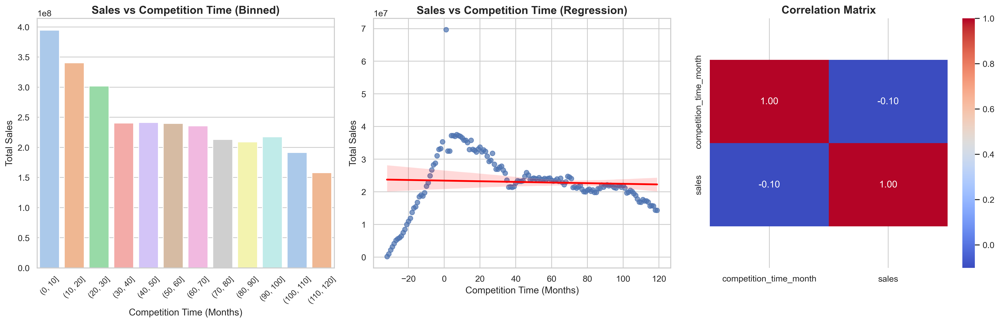

#### H7. Lojas abertas durante o feriado de Natal deveriam vender mais.

**FALSA Lojas abertas durante o feriado do Natal vendem MENOS.**

Isso pode ser explicado pelo fato de que, durante o feriado, muitos clientes antecipam suas compras, reduzindo a demanda no próprio dia de Natal. Além disso, a cultura local e hábitos de consumo podem influenciar esse comportamento, já que muitas pessoas preferem passar o feriado em casa, em vez de irem às compras.

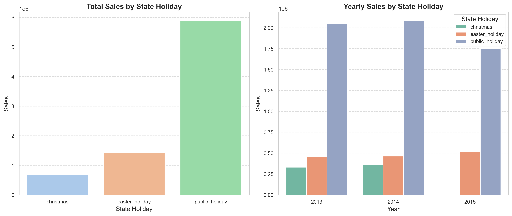

#### H8. Lojas deveriam vender mais ao longo dos anos.

**FALSA Lojas vendem menos ao longo dos anos**

Esse declínio pode estar relacionado a fatores como mudanças no comportamento do consumidor, aumento da concorrência e impacto do comércio eletrônico, que vem ganhando espaço e reduzindo o fluxo de clientes nas lojas físicas. Além disso, crises econômicas e variações no poder de compra podem ter afetado a demanda ao longo do tempo.

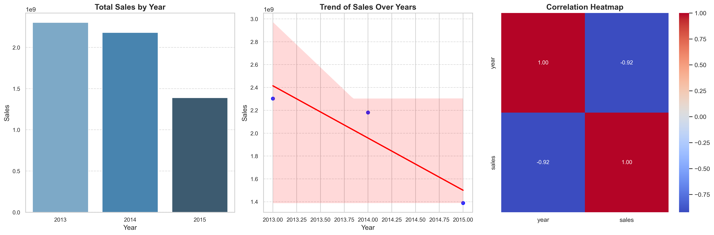

#### H9. Lojas deveriam vender mais no segundo semestre do ano.

**FALSA Lojas vendem menos no segundo semestre do ano**

Esse resultado pode estar relacionado ao fato de que muitos clientes realizam compras maiores no início do ano, aproveitando promoções pós-festas e reajustes salariais. Além disso, fatores como redução do consumo após férias de verão, incertezas econômicas e menor frequência de promoções podem ter impactado negativamente o desempenho das lojas na segunda metade do ano.

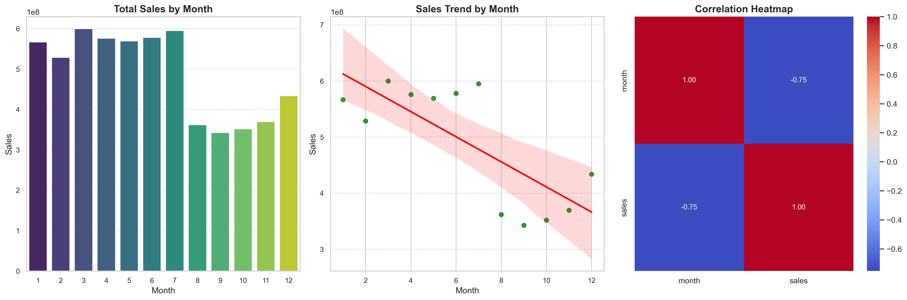

#### H10. Lojas deveriam vender mais depois do dia 10 de cada mês.

**VERDADEIRA Lojas vendem mais depois do dia 10 de cada mês.**

Isso pode estar diretamente ligado ao calendário financeiro dos consumidores, já que muitas pessoas recebem seus salários entre os dias 5 e 10 do mês. Após esse período, há um aumento no poder de compra, resultando em um maior volume de vendas nas lojas. Esse comportamento reforça a importância de ações promocionais estratégicas logo após essa data, para potencializar os ganhos da empresa.

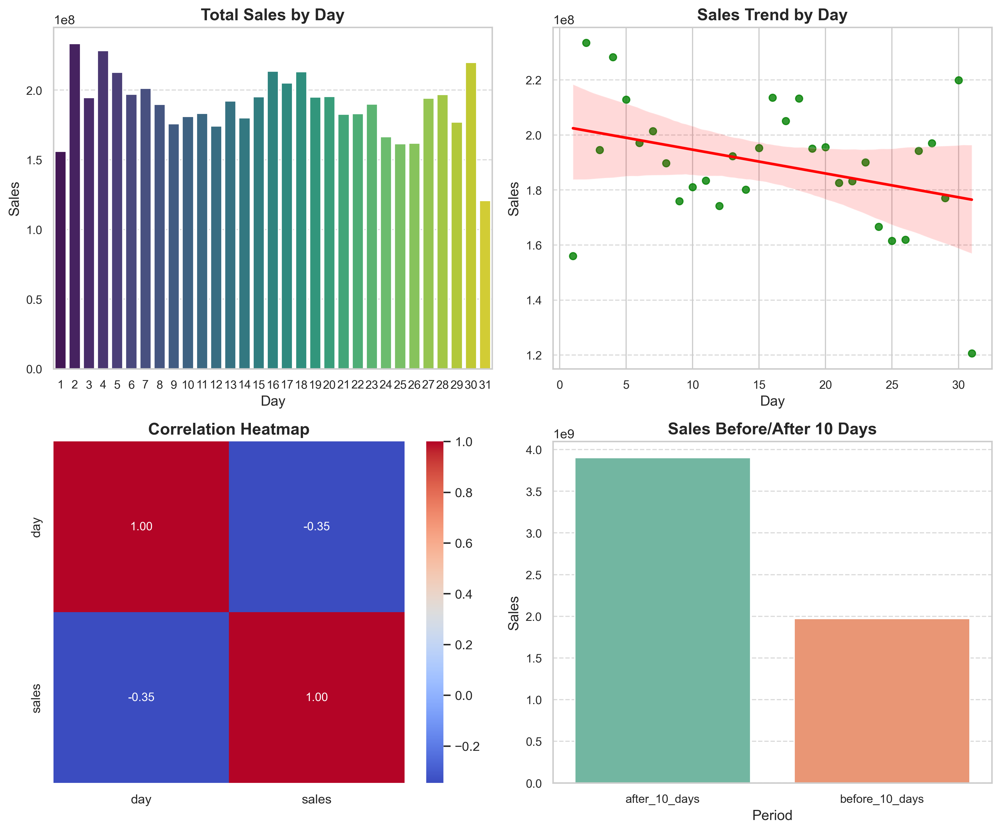

#### H11. Lojas deveriam vender menos aos finais de semana.

**VERDADEIRA Lojas vendem menos nos final de semana.**

Isso pode estar relacionado a mudanças nos hábitos de consumo, onde os clientes tendem a realizar compras maiores durante a semana e evitam ir às lojas nos finais de semana. Além disso, fatores como horários reduzidos de funcionamento, menor fluxo comercial em determinadas regiões e preferência por compras online ou em grandes mercados podem contribuir para essa queda nas vendas.

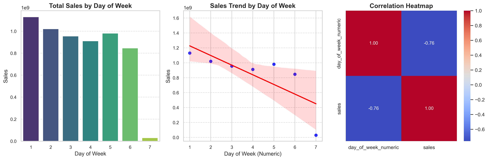

### Tabela de Insights 

| Hipóteses | Condição| Relevância |
| :-------- | :------- | :--------  |
|H1. Lojas com maior sortimento deveriam vender mais|Falsa|Baixa|
|H2. Lojas com competidores mais próximos deveriam vender menos.|Falsa|Média|
|H3. Lojas com competidores à mais tempo deveriam vender mais.|Falsa|Média|
|H4. Lojas com promoções mais ativas por mais tempo deveriam vender mais.|Falsa|Baixa|
|H5. Lojas com mais dias de promoção deveriam vender mais.| --- |---|
|H6. Lojas com mais promoções consecutivas deveriam vender mais.|Falsa|Baixa|
|H7. Lojas abertas durante o feriado de Natal deveriam vender mais|Falsa|Média|
|H8. Lojas deveriam vender mais ao longo dos anos.|Falsa|Alta|
|H9. Lojas deveriam vender mais no segundo semestre do ano.|Falsa|Alta|
|H10 .Lojas deveriam vender mais depois do dia 10 de cada mês.|Verdadeira|Alta|
|H11 .Lojas deveriam vender menos aos finais de semana.|Verdadeira|Alta|
|H12 .Lojas deveriam vender menos durante os feriados escolares.|Verdadeira|Baixa|

### 5.3. Análise Multivariada

A análise multivariada foi realizada para identificar quais variáveis possuem maior impacto na previsão das vendas e entender as relações entre elas. Esse processo é essencial para evitar multicolinearidade, ou seja, quando duas ou mais variáveis explicativas estão altamente correlacionadas, o que pode distorcer a interpretação do modelo.

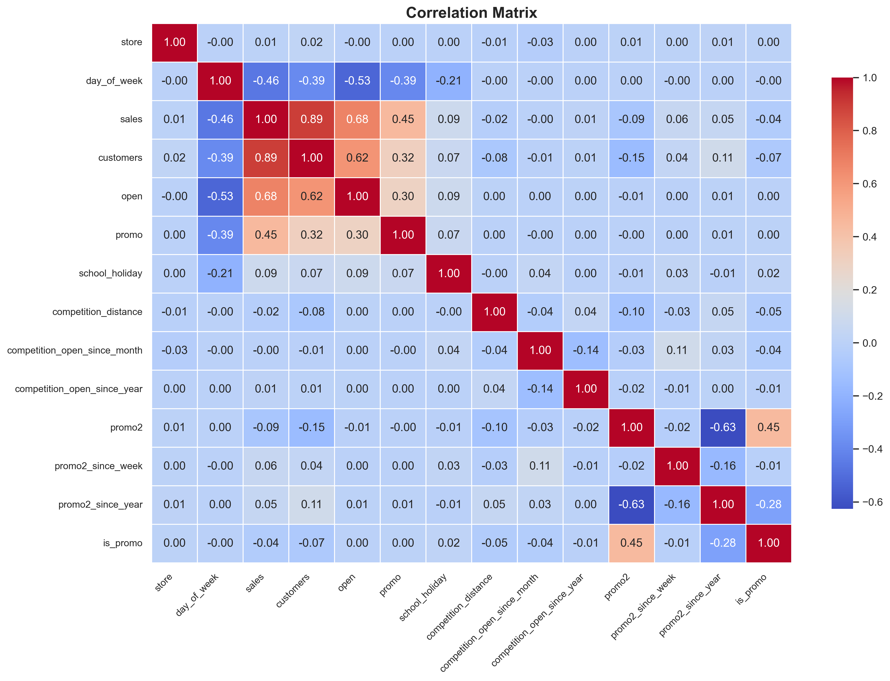

# 6. Seleção do Modelo de Machine Learning

Para prever as vendas das lojas Rossmann, foram testados diferentes algoritmos de Machine Learning, variando desde modelos mais simples até técnicas avançadas de aprendizado de máquina.

* __Mean Average Model__ (Baseline): Modelo simples que calcula a média das vendas passadas e serve como referência para avaliar o desempenho dos modelos mais complexos.
* __Regressão Linear__: Modelo estatístico que busca uma relação linear entre as variáveis explicativas e a variável resposta (vendas).
* __Regressão Linear Regularizada - Lasso__: Variante da regressão linear que adiciona uma penalização (L1) para reduzir a complexidade do modelo e evitar overfitting.
* __Random Forest Regressor__: Algoritmo baseado em árvores de decisão que combina várias árvores para aumentar a precisão e robustez da previsão.
* __XGBoost Regressor__: Um dos modelos mais poderosos e eficientes para previsão, baseado em Gradient Boosting, que otimiza o aprendizado através da minimização do erro em sucessivas iterações.

Além disso, foi utilizada a técnica de Cross-Validation para validar a performance de todos os modelos e garantir que as previsões fossem generalizáveis, reduzindo o risco de overfitting.

# 7. Performance do Modelo

Para avaliar a qualidade dos modelos preditivos, foram utilizadas métricas como __MAPE (Mean Absolute Percentage Error)__, que mede o erro médio percentual das previsões em relação aos valores reais.

O RandomForestRegressor apresentou o melhor desempenho em Single Performance, com um erro médio (MAPE) de aproximadamente 10%.

No entanto, a escolha final foi pelo XGBoost Regressor, pois sua performance foi equivalente à do RandomForest, mas com vantagens adicionais:

* Melhor escalabilidade para grandes volumes de dados.
* Treinamento mais rápido devido ao seu eficiente processo de Gradient Boosting.
* Menor consumo de memória, tornando-o mais adequado para uso em produção.

Com isso, o XGBoost foi implementado como o modelo final para previsão das vendas, garantindo precisão e eficiência computacional.

### Comparação de Desempenho dos Modelos  

| Modelo                     | MAE (Erro Absoluto Médio) | MAPE (Erro Percentual Médio) | RMSE (Raiz do Erro Quadrático Médio) |
|----------------------------|--------------------------|-----------------------------|--------------------------------------|
| **Regressão Linear**       | 1867.09                  | 29.27%                      | 2671.05                              |
| **Regressão Linear - Lasso** | 1891.70                  | 28.91%                      | 2744.45                              |
| **Random Forest Regressor** | 679.60                   | 9.99%                       | 1011.11                              |
| **XGBoost Regressor**       | 1694.95                  | 25.17%                      | 2477.85                              |

### Performance dos Modelos com Cross-Validation  

| Modelo                     | MAE CV (Erro Absoluto Médio)        | MAPE CV (Erro Percentual Médio)    | RMSE CV (Raiz do Erro Quadrático Médio)  |
|----------------------------|-----------------------------------|----------------------------------|--------------------------------------|
| **Regressão Linear**       | 2081.73 ± 295.63                 | 30% ± 2%                        | 2952.52 ± 468.37                    |
| **Regressão Linear - Lasso** | 2116.38 ± 341.5                  | 29% ± 1%                        | 3057.75 ± 504.26                    |
| **Random Forest Regressor** | 836.61 ± 217.1                  | 12% ± 2%                        | 1254.3 ± 316.17                     |
| **XGBoost Regressor**       | 1860.91 ± 291.37                 | 25% ± 1%                        | 2685.66 ± 429.14                    |

### Ajuste de Hiperparâmetros (Hyperparameter Fine-Tuning)  

Após a escolha do **XGBoost Regressor**, foi realizada a etapa de **Hyperparameter Fine-Tuning**, utilizando o método **Random Search** para encontrar os melhores parâmetros de treino e maximizar a performance do modelo.  

Os hiperparâmetros otimizados incluem:  
**Número de árvores (`n_estimators`)**: *2500*  
**Taxa de aprendizado (`eta`)**: *0.03*  
**Profundidade máxima das árvores (`max_depth`)**: *9*  
**Amostragem de instâncias (`subsample`)**: *0.5*  
**Colunas amostradas por árvore (`colsample_bytree`)**: *0.9*  
**Peso mínimo para divisão (`min_child_weight`)**: *15*  

Após a otimização, os **resultados finais do modelo XGBoost** foram:  

### **Desempenho Final do Modelo**  

| Modelo               | MAE (Erro Absoluto Médio) | MAPE (Erro Percentual Médio) | RMSE (Raiz do Erro Quadrático Médio) |
|----------------------|--------------------------|------------------------------|--------------------------------------|
| **XGBoost Regressor** | **632.87**               | **9.13%**                    | **929.02**                          |

O ajuste dos hiperparâmetros resultou em uma **redução significativa do erro**, tornando o modelo XGBoost mais preciso e eficiente para prever as vendas das lojas Rossmann.

# 8. Resultados de Negócio

Após a aplicação do ciclo inicial do CRISP-DM, foi estimado que as 1115 lojas da Rossmann alcançarão um faturamento aproximado de $283 milhões nas próximas 6 semanas, com uma margem de erro de 9,13%. Além disso, foram projetados possíveis melhores e piores cenários de faturamento.

| Cenário           | Valores (R$)          |
|------------------|----------------------|
| **Previsões**    | **R$ 283.360.736,00** |
| **Pior Cenário** | **R$ 282.650.949,27** |
| **Melhor Cenário** | **R$ 284.070.491,40** |

O **modelo XGBoost apresentou um bom desempenho**, sendo capaz de prever as vendas com alta precisão. No entanto, algumas lojas tiveram um **MAPE acima da média**, indicando que certos pontos de venda são mais desafiadores de prever do que outros.  

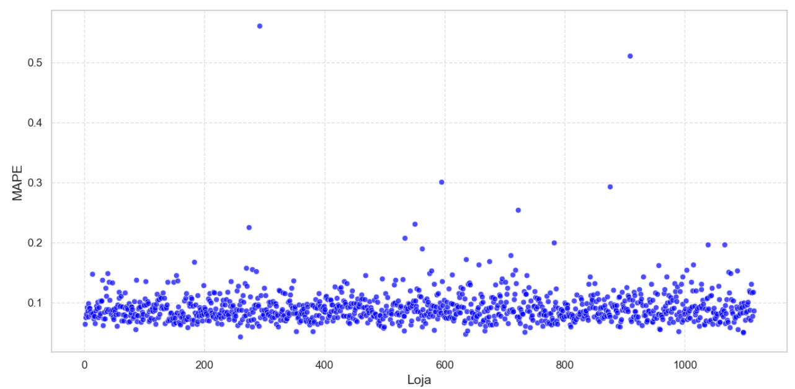

**Evolução das Previsões**:
- O **1º gráfico** mostra as vendas reais (linhas azuis) e as previsões do modelo (linhas laranjas). O modelo acompanha bem as tendências do mercado, garantindo previsões confiáveis.  
- O **2º gráfico** apresenta a taxa de erro das previsões, demonstrando que os valores previstos estão dentro de uma margem aceitável.  
- O **3º gráfico** exibe a distribuição dos erros, que segue um comportamento próximo de uma distribuição normal, com tendência central em 0.  
- O **4º gráfico** demonstra a dispersão dos erros, idealmente concentrada em uma faixa estreita, representando baixa variação entre os valores reais e previstos.

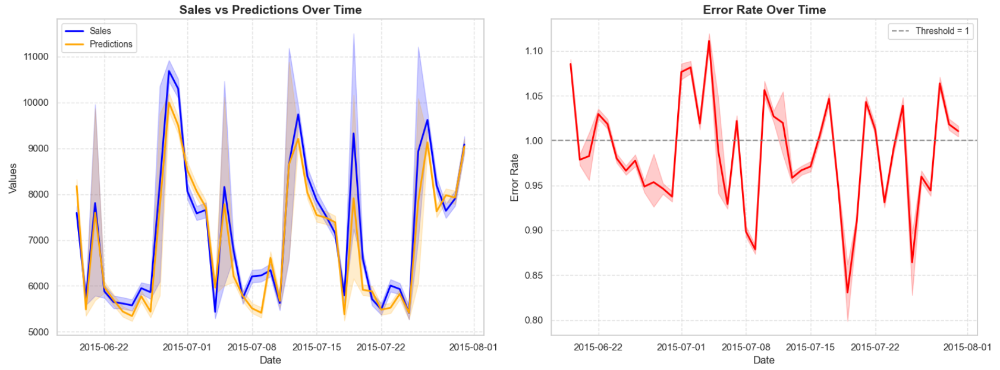

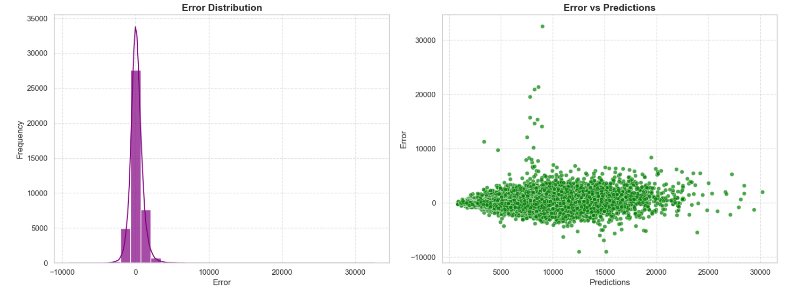

Com essa análise, podemos concluir que o **modelo XGBoost é uma solução eficiente para previsão de vendas** e pode ser utilizado para otimizar o planejamento estratégico da Rossmann. 

# 9. Modelo em Produção

O modelo de Machine Learning foi colocado em produção na nuvem e, para facilitar o acesso à previsão de vendas das lojas para as próximas 6 semanas, foi criado um BOT no Telegram. Esse BOT permite que o CEO e a equipe de negócios consultem as informações de forma simples e direta, utilizando apenas um smartphone.

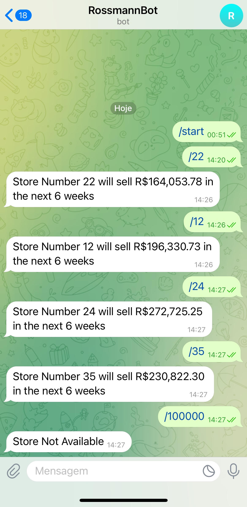

# 10. Conclusão

Neste projeto, foi aplicado todas as etapas fundamentais de um fluxo completo de Ciência de Dados, seguindo a metodologia CRISP-DM, desde o entendimento do problema até a implementação de um modelo preditivo. O objetivo principal era desenvolver um modelo capaz de prever as vendas diárias das lojas Rossmann para as próximas 6 semanas, ajudando na tomada de decisões estratégicas.

Através da Análise Exploratória de Dados (EDA), foram extraídos diversos insights valiosos, como o impacto das promoções, a influência dos feriados nas vendas e o efeito da concorrência no faturamento das lojas. Esses achados foram essenciais para a construção do modelo e para guiar o planejamento estratégico da empresa.

Após testar diferentes algoritmos, o modelo XGBoost Regressor foi escolhido por apresentar um bom equilíbrio entre performance, escalabilidade e eficiência computacional. Com MAPE médio de aproximadamente 9%, o modelo mostrou-se confiável para previsão de vendas. As previsões finais indicaram um faturamento estimado de R$ 283 milhões no período analisado.

Além disso, o modelo foi disponibilizado de forma acessível, permitindo que as previsões sejam consultadas de maneira rápida e eficiente. Esse resultado mostra como a Ciência de Dados pode impactar diretamente o negócio, auxiliando na alocação de recursos, planejamento de estoque e estratégias promocionais.

# 11. Aprendizados e Trabalhos Futuros

## 11.1. Aprendizados

- Modelos preditivos devem considerar não apenas a precisão, mas também a escalabilidade e aplicabilidade em produção. O XGBoost foi escolhido justamente por atender bem esses critérios.
- A Análise Exploratória de Dados (EDA) foi essencial para identificar padrões e validar hipóteses. Muitos insights encontrados ajudaram a aprimorar o modelo e a entender melhor o comportamento das lojas.
- A escolha das features tem um impacto direto no desempenho do modelo, e técnicas de Feature Engineering foram fundamentais para otimizar a qualidade das previsões.

## 11.2. Trabalhos Futuros

- Aprofundar a análise das lojas com maiores taxas de erro, podendo desenvolver um modelo específico para elas.
- Criar novas variáveis (features) a partir de correlações fortes, buscando melhorar ainda mais a performance do modelo.
- Testar métodos alternativos de Encoding para variáveis categóricas, a fim de verificar se melhoram os resultados.
- Realizar um novo ajuste de hiperparâmetros (Fine-Tuning) para tentar reduzir ainda mais o erro do modelo.
- Explorar diferentes abordagens de Machine Learning, como LSTM (Redes Neurais Recorrentes) para séries temporais.
- Expandir a usabilidade da previsão, integrando-a em um sistema ou aplicação móvel para facilitar o acesso por parte dos gestores da Rossmann.

 Com essas melhorias, o modelo poderá atingir um nível de precisão ainda maior, garantindo previsões mais assertivas e um impacto direto na tomada de decisões estratégicas.
